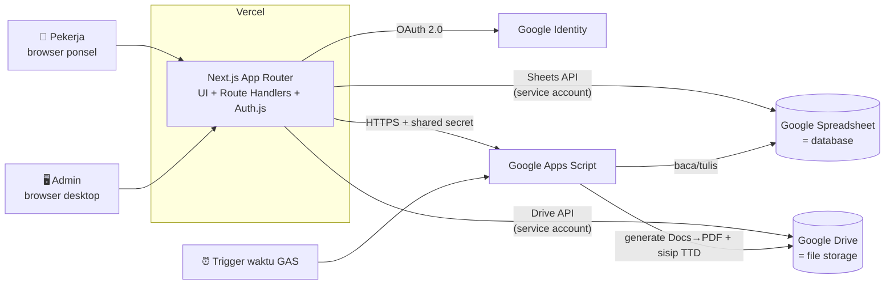

# Rekomendasi Arsitektur — LaporanTAD

Dokumen terkait: [BRD.md](BRD.md) · [PRD.md](PRD.md) · [TASKS.md](TASKS.md)

---

## 1. Ringkasan Keputusan

| Lapisan | Teknologi | Alasan |
|---------|-----------|--------|
| Frontend + Backend API | **Next.js (App Router, TypeScript) di Vercel** | Satu codebase untuk UI mobile pekerja & desktop admin + API; deploy gratis; DX terbaik |
| Autentikasi | **Auth.js (NextAuth) — Google Provider** | Sesuai syarat "hanya Google login"; session JWT tanpa perlu database sesi |
| Basis data | **Google Spreadsheet** via Sheets API (service account) | Ketentuan pemilik produk; aman untuk < 100 pengguna |
| Penyimpanan berkas | **Google Drive** via Drive API (service account) | Evidence & dokumen; folder terstruktur; privat |
| Pekerja latar (worker) | **Google Apps Script (GAS)** | Generate dokumen dari template Google Docs → PDF (termasuk menyisipkan gambar TTD), cron (sync libur, backup) — semuanya gratis & native Google |
| UI kit | Tailwind CSS + shadcn/ui | Cepat, konsisten, profesional |
| Validasi | Zod (shared schema client & server) | Satu sumber aturan validasi |

**Prinsip utama: Vercel adalah otak, Google adalah gudang, GAS adalah kurir.**
Semua logika bisnis & otorisasi berjalan di Next.js (mudah di-debug, di-test, di-versikan). Sheets/Drive murni penyimpanan. GAS hanya untuk hal yang memang paling mudah dilakukan GAS (Docs→PDF, trigger waktu) — bukan sebagai backend utama.

## 2. Diagram Arsitektur



## 3. Pembagian Tanggung Jawab

| Komponen | Bertanggung jawab atas | TIDAK boleh |
|----------|------------------------|-------------|
| **Next.js (Vercel)** | Seluruh UI, autentikasi, otorisasi role/status, validasi, logika bisnis (saldo cuti, total jam, kunci periode), CRUD ke Sheets, upload/stream berkas Drive, ekspor XLSX | Menyimpan state permanen di memori/disk |
| **Google Spreadsheet** | Menyimpan data tabular (1 tab = 1 tabel) | Berisi formula/logic bisnis (kecuali kolom bantu non-kritis); diedit manual |
| **Google Drive** | Evidence, lampiran, dokumen umum, template, arsip backup | Berbagi tautan publik |
| **GAS** | Generate dokumen (template Docs → PDF + sisip gambar TTD), cron: sync libur nasional, backup mingguan | Menjadi API CRUD utama; menyimpan logika bisnis inti |

### Kenapa GAS tidak dijadikan backend penuh?

| Aspek | GAS sebagai backend penuh | Next.js API + Sheets API (dipilih) |
|-------|---------------------------|-------------------------------------|
| Latensi | Cold start 1–3 dtk per request, sering lebih | 100–500 ms |
| Debugging | Logger terbatas, tanpa breakpoint lokal | Penuh (lokal, TypeScript, test) |
| Versi & rollback | Manual, rawan | Git + preview deployment Vercel |
| Keamanan endpoint | Web App "anyone" + secret sendiri | Session-aware, middleware per route |
| Kuota | 20.000 URL fetch/hari, 6 menit/eksekusi | Kuota Sheets API longgar untuk skala ini |

GAS tetap dipakai — tetapi hanya untuk keunggulan uniknya (Docs→PDF, trigger waktu). Ini membuat sistem **mudah di-maintain**: satu tempat logika (Next.js), GAS berisi skrip kecil yang jarang berubah.

## 4. Alur Data Penting

### 4.1 Login & gerbang status
1. Auth.js Google OAuth → dapat email + nama + foto.
2. Callback `session`: baca baris `users` (cache 60 dtk) → sisipkan `role`, `status`, `user_id` ke JWT/session.
3. Middleware mengarahkan: tanpa baris → `/register`; `pending` → `/menunggu`; `rejected` → `/ditolak`; `inactive` → `/nonaktif`; `active` → aplikasi.
4. Setiap route handler mutasi **memvalidasi ulang** role/status dari session + cek kunci periode di server.

### 4.2 Catat lembur + evidence
1. Klien kompresi gambar (`browser-image-compression`, target ≤ 1,5 MB) → `POST /api/overtime` (multipart).
2. Server: validasi Zod → cek periode tidak terkunci → cek duplikat/tumpang tindih → upload evidence ke Drive (`evidence/lembur/{tahun}/{bulan}/`) → append baris ke tab `overtime` → tulis `audit_log`.
3. Respons berisi baris baru → UI menambahkan ke daftar (grup bulan→tanggal).

### 4.3 Generate dokumen + tanda tangan (GAS)
1. Pemilik catatan (atau admin) memilih dokumen dari sebuah catatan (SPKL dari catatan lembur; SPD & Deklarasi Dinas dari catatan dinas; Surat Cuti dari catatan cuti) → `POST /api/generate`.
2. **Wajib TTD** sebelum kirim: penanda tangan memilih TTD tersimpan (`users.ttd_file_id`) **atau** mengunggah/menggambar TTD baru (PNG transparan). Tanpa TTD, tombol Generate nonaktif. Server memvalidasi kepemilikan catatan + ketersediaan TTD.
3. Next.js memanggil GAS Web App (`?secret=…`) dengan payload JSON + `ttd_file_id`.
4. GAS: copy template Docs → replace placeholder `{{…}}` → sisipkan gambar TTD pada placeholder `{{ttd}}` → export PDF (**tanpa enkripsi/proteksi password**) → simpan `dokumen/generated/{tahun}/{bulan}/` → balas `file_id`.
5. Next.js mencatat ke tab `documents` (dengan `signed_by`) → pengguna mengunduh via `/api/files/{id}` (stream, cek akses).

## 5. Struktur Folder Google Drive

```
📁 LaporanTAD/
├── 📄 LaporanTAD-Database        (Spreadsheet utama)
├── 📁 evidence/
│   ├── 📁 lembur/2026/07/        → {nopek}_{2026-07-11}_{id}.jpg|pdf
│   ├── 📁 cuti/2026/
│   └── 📁 dinas/2026/
├── 📁 dokumen/
│   ├── 📁 umum/                  (SOP, formulir, pengumuman)
│   ├── 📁 template/              (Google Docs ber-placeholder, termasuk {{ttd}})
│   ├── 📁 ttd/                   (gambar tanda tangan PNG per pekerja — privat)
│   └── 📁 generated/2026/07/     (SPKL, SPD, Deklarasi Dinas, Surat Cuti — PDF bertanda tangan)
└── 📁 arsip-backup/              (salinan mingguan spreadsheet oleh GAS)
```

Seluruh folder **privat** — hanya service account + akun pemilik. Unduhan pengguna selalu melalui `/api/files/{id}` yang memeriksa hak akses lalu men-stream isi berkas.

## 6. Skema Spreadsheet (1 tab = 1 tabel)

Semua tab memakai baris pertama sebagai header; kolom `id` = ULID; `created_at`/`updated_at` ISO-8601 WIB.

| Tab | Kolom |
|-----|-------|
| `users` | id, email, nama_lengkap, nopek, company_id, lokasi_kerja, divisi, bagian, tipe_kerja(`shift`\|`nonshift`), nama_shift, no_telp, darurat_alamat, darurat_telp, darurat_hubungan, foto_url, ttd_file_id *(gambar TTD tersimpan, opsional)*, role(`admin`\|`pekerja`), status(`pending`\|`active`\|`rejected`\|`inactive`), alasan_tolak, approved_by, approved_at, created_at, updated_at |
| `companies` | id, nama, pic_nama, pic_telp, alamat, active, created_at |
| `master_options` | id, kategori(`lokasi`\|`divisi`\|`bagian`\|`shift`\|`hubungan_darurat`\|`kategori_dokumen`), nilai, urutan, active |
| `overtime` | id, user_id, tanggal, jenis(`reguler`\|`libur_nasional`\|`kjk`\|`cuti`), holiday_id, replaced_user_id, keterangan, jam_mulai, jam_selesai, total_jam, evidence_file_id, status(*disiapkan utk approval fase 2, V1 selalu `tercatat`*), created_at, updated_at |
| `leaves` | id, user_id, leave_type_id, tanggal_mulai, tanggal_selesai, jumlah_hari, keterangan, lampiran_file_id, status(*idem*), created_at, updated_at |
| `leave_types` | id, nama, potong_saldo(TRUE/FALSE), wajib_lampiran(TRUE/FALSE), active |
| `leave_balances` | id, user_id, tahun, kuota, penyesuaian, catatan, updated_at *(terpakai & sisa dihitung dari `leaves`, tidak disimpan — hindari data ganda)* |
| `trips` | id, user_id, tujuan, tanggal_mulai, tanggal_selesai, keperluan, transportasi, keterangan, lampiran_file_id, status(`draft`\|`spd_terbit`\|`menunggu_deklarasi`\|`selesai` — siklus hidup dua dokumen), tanggal_realisasi_mulai, tanggal_realisasi_selesai, deklarasi_catatan, created_at, updated_at |
| `trip_costs` | id, trip_id, user_id, komponen, keterangan, jumlah(rupiah), bukti_file_id, urutan, created_at *(rincian biaya Deklarasi Dinas — satu baris per komponen)* |
| `holidays` | id, tanggal, nama, tahun, sumber(`api`\|`manual`) |
| `documents` | id, judul, kategori(`umum`\|`generated`), jenis_dok(`spkl`\|`spd`\|`deklarasi_dinas`\|`surat_cuti`\|`-`), sumber_entitas, sumber_id, file_id, mime, ukuran, uploaded_by, signed_by, created_at |
| `doc_templates` | id, nama, jenis(`spkl`\|`spd`\|`deklarasi_dinas`\|`surat_cuti`), gdoc_id, keterangan, active, created_at |
| `period_locks` | id, periode(`YYYY-MM`), locked_by, locked_at |
| `settings` | key, value, keterangan *(mis. `default_kuota_cuti=12`, `batas_lembur_hari_kerja=4`, `batas_lembur_libur=12`, `batas_lembur_mingguan=18`)* |
| `audit_log` | id, timestamp, actor_email, aksi, entitas, entitas_id, detail_json |

> Kolom `status` pada transaksi sengaja disiapkan sejak V1 agar penambahan alur approval di masa depan **tidak butuh migrasi data**.

## 7. Desain API (Next.js Route Handlers)

| Method & Path | Akses | Fungsi |
|---------------|-------|--------|
| `GET/POST /api/auth/[...nextauth]` | publik | Auth.js |
| `POST /api/register` | login | Simpan registrasi (status `pending`) |
| `GET/PATCH /api/me` | active | Profil sendiri |
| `GET /api/overtime?month=YYYY-MM` · `POST /api/overtime` | active | Daftar (miliknya) & catat |
| `PATCH/DELETE /api/overtime/{id}` | pemilik | Ubah/hapus (cek kunci periode) |
| `GET/POST /api/leaves` · `PATCH/DELETE /api/leaves/{id}` · `GET /api/leaves/balance` | active | Cuti + saldo |
| `GET/POST /api/trips` · `GET/PATCH/DELETE /api/trips/{id}` | active | Dinas (list membawa fase & total biaya; `GET /{id}` = detail + biaya + dokumen) |
| `PATCH /api/trips/{id}/deklarasi` | pemilik/admin | Simpan realisasi + rincian biaya (fase 2); SPD wajib terbit dulu |
| `GET /api/holidays?year=` | active | Libur nasional |
| `GET /api/users` | active | Direktori (tanpa kontak darurat) |
| `GET /api/documents` · `GET /api/files/{id}` | active | Dokumen & stream berkas |
| `GET /api/admin/registrations` · `POST /api/admin/registrations/{id}/approve|reject` | admin | Verifikasi |
| `GET/POST/PATCH /api/admin/users/{id}` | admin | Master pekerja (role, status, kuota) |
| `CRUD /api/admin/companies` · `/api/admin/templates` · `/api/admin/options` · `/api/admin/holidays` | admin | Master data |
| `GET/POST/DELETE /api/admin/locks` | admin | Kunci periode |
| `GET /api/admin/export?type=&month=&company=` | admin | XLSX/CSV |
| `PUT /api/me/ttd` · `DELETE /api/me/ttd` | active | Simpan/hapus gambar TTD tersimpan (ke `dokumen/ttd/`) |
| `POST /api/generate` | active (pemilik catatan) / admin | Wajib sertakan TTD; panggil GAS docgen (SPKL/SPD/Deklarasi Dinas/Surat Cuti); server cek kepemilikan catatan |
| `GET /api/admin/audit` | admin | Log audit |

## 8. Pola Kode (kunci kemudahan maintenance & debugging)

```
src/
├── app/
│   ├── (auth)/login, register, menunggu, ditolak, nonaktif
│   ├── (pekerja)/beranda, lembur, cuti, dinas, kalender, dokumen, pekerja, profil, lainnya
│   ├── (admin)/admin/{dashboard, registrasi, pekerja, perusahaan, template, opsi, libur, kunci-periode, ekspor, audit}
│   └── api/... (route handlers §7)
├── components/{ui, forms, layout, shared}
├── lib/
│   ├── auth.ts            (konfigurasi Auth.js + helper requireRole)
│   ├── google/sheets.ts   (klien Sheets: getRows/appendRow/updateRow/deleteRow generik)
│   ├── google/drive.ts    (upload/stream/delete)
│   ├── gas.ts             (klien GAS + shared secret)
│   ├── cache.ts           (cache in-memory + revalidateTag)
│   ├── period-lock.ts     (satu-satunya pintu pengecekan kunci periode)
│   ├── overtime-rules.ts  (satu-satunya pintu validasi batas jam lembur 4/12/18 + pengecualian KJK)
│   └── audit.ts           (satu-satunya pintu penulisan log)
├── repositories/          (users.ts, overtime.ts, leaves.ts, …)
├── schemas/               (Zod — dipakai client & server)
└── gas/                   (source Apps Script, deploy via clasp: docgen.js, cron.js)
```

Aturan yang menjaga kualitas:

1. **Repository pattern** — UI/route tidak pernah menyentuh Sheets langsung; hanya lewat `repositories/*`. Bila kelak migrasi ke Postgres, hanya lapisan ini yang ditulis ulang.
2. **Validasi tunggal** — skema Zod yang sama dipakai form client & route server.
3. **Pintu tunggal** untuk aturan lintas modul: `period-lock.ts` dan `audit.ts` dipanggil semua repository mutasi — mustahil lupa.
4. **Error berkode** — respons error `{ code, message }` (mis. `PERIODE_TERKUNCI`, `SALDO_KURANG`) agar UI menampilkan pesan Indonesia yang tepat dan log mudah dilacak.
5. **GAS di-versikan di repo** (folder `gas/`, deploy dengan `clasp push`) — tidak ada skrip "misterius" yang hanya ada di editor GAS.
6. **Angka aturan bisnis di `settings`, bukan hard-code** — batas jam lembur (4/12/18) dan kuota cuti default dibaca dari tab `settings`, sehingga perubahan kebijakan tidak butuh deploy ulang.

## 9. Keamanan

| Area | Kebijakan |
|------|-----------|
| Autentikasi | Hanya Google OAuth; session JWT (`AUTH_SECRET`) |
| Otorisasi | Middleware (redirect UX) **dan** pemeriksaan role/status/ kepemilikan di tiap route handler (keamanan sesungguhnya) |
| Service account | Key JSON hanya di env Vercel; scope minimal (`spreadsheets`, `drive.file`/`drive`); spreadsheet & folder hanya dibagikan ke service account + pemilik |
| Vercel ↔ GAS | Header rahasia (`GAS_SHARED_SECRET`); GAS menolak request tanpa secret; payload tanpa data sensitif berlebih |
| Berkas | Tidak ada tautan publik; unduh via `/api/files/{id}` dengan cek akses (pemilik/admin) |
| Tanda tangan (TTD) | Gambar TTD & PDF hasil generate disimpan **tanpa enkripsi/proteksi password** (keputusan pemilik produk); tetap privat di Drive dan hanya diakses via aplikasi. TTD milik pekerja hanya dapat dipakai oleh pekerja itu sendiri atau admin |
| Data pribadi | Kontak darurat difilter di lapisan repository untuk non-admin; tidak pernah dikirim ke klien direktori |
| Audit | `audit_log` append-only dari sisi aplikasi |

## 10. Batasan Platform & Mitigasi

| Batasan | Nilai | Mitigasi |
|---------|-------|----------|
| Sheets API read | 300 req/menit/proyek | Cache master data (users, companies, options, holidays) 60 dtk; baca per-tab sekali per request |
| Sheets API write | 60 req/menit/pengguna | Append batch; skala < 100 user aman |
| Vercel body limit | ± 4,5 MB | Kompresi gambar client-side ≤ 1,5 MB; PDF maks 4 MB |
| Vercel function timeout (hobby) | 10–60 dtk | Operasi berat (docgen, backup) didelegasikan ke GAS |
| GAS eksekusi | 6 menit/run | Cron dipecah kecil (per fungsi) |
| Konkurensi tulis Sheets | Tidak ada transaksi | Pola append-dominan; update memakai pembacaan ulang baris + pencocokan `id` (bukan nomor baris); konflik sangat jarang di skala ini |

## 11. Environment Variables

```
AUTH_SECRET=                     # openssl rand -base64 32
AUTH_GOOGLE_ID=                  # OAuth Client ID
AUTH_GOOGLE_SECRET=              # OAuth Client Secret
GOOGLE_SA_EMAIL=                 # service account email
GOOGLE_SA_PRIVATE_KEY=           # private key (escaped \n)
SHEETS_DATABASE_ID=              # ID spreadsheet utama
DRIVE_ROOT_FOLDER_ID=            # ID folder LaporanTAD/
GAS_WEBAPP_URL=                  # URL deployment GAS
GAS_SHARED_SECRET=               # secret bersama Vercel↔GAS
```

## 12. Lingkungan & Deployment

- **Lokal:** `.env.local` + spreadsheet duplikat khusus development (jangan menunjuk data produksi).
- **Preview:** setiap PR otomatis mendapat URL preview Vercel (pakai spreadsheet dev).
- **Produksi:** branch `main` → Vercel production; GAS dideploy manual `clasp push && clasp deploy` (jarang berubah).

## 13. Jalur Migrasi Masa Depan

Jika pengguna/volume tumbuh melewati nyaman-nya Sheets (gejala: rate limit, latensi baca > 2 dtk):

1. Ganti implementasi `repositories/*` ke Postgres (mis. Neon/Supabase — tetap ada tier gratis) — UI, route, dan skema Zod **tidak berubah**.
2. Skrip migrasi satu kali: baca semua tab → insert ke tabel SQL (struktur sudah 1:1).
3. Drive tetap dipakai untuk berkas; GAS tetap untuk docgen.

Dengan repository pattern sejak hari pertama, migrasi ini adalah pekerjaan hitungan hari, bukan penulisan ulang.
