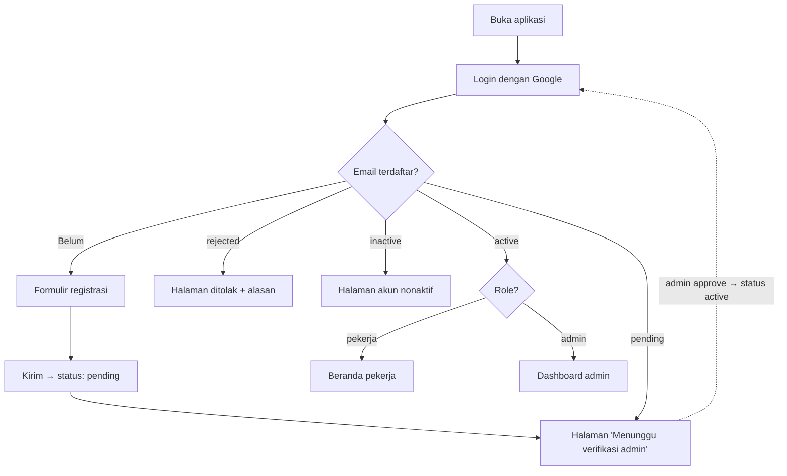
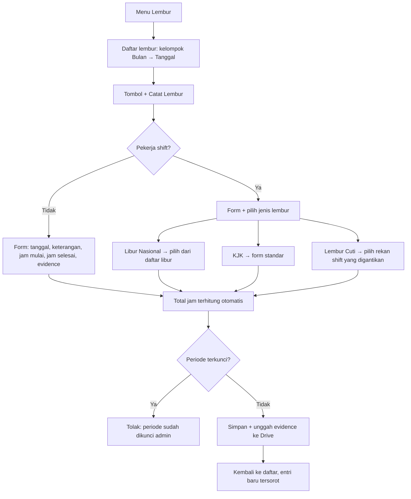

# Product Requirements Document (PRD)

## Aplikasi Administrasi Pekerja TAD (LaporanTAD)

| Informasi Dokumen | |
|---|---|
| **Versi** | 1.0 (Draft) |
| **Tanggal** | 11 Juli 2026 |
| **Dokumen Terkait** | [BRD.md](BRD.md) · [ARSITEKTUR.md](ARSITEKTUR.md) · [TASKS.md](TASKS.md) |

---

## 1. Gambaran Produk

Aplikasi web dengan dua pengalaman berbeda:

- **Pekerja (Desktop & mobile)** — mencatat lembur/cuti/dinas dari ponsel atau desktop dalam ≤ 2 menit, melihat sisa cuti, kalender, direktori rekan, dan dokumen.
- **Admin (desktop & mobile)** — memverifikasi pendaftar, mengelola master data, mengunci periode, dan mengekspor rekap.

Gaya visual: **modern & profesional** — bersih, banyak ruang kosong, satu warna aksen, tipografi jelas, animasi halus dan fungsional.

## 2. Persona

| Persona | Konteks | Kebutuhan Utama |
|---------|---------|-----------------|
| **Pekerja non-shift** | Jam kantor, akses via ponsel | Catat lembur cepat + unggah foto evidence |
| **Pekerja shift** | Kerja bergilir (pagi/sore/malam), termasuk akhir pekan & hari libur | Jenis lembur khusus (Libur Nasional/KJK/Lembur Cuti), lembur lintas tengah malam |
| **Admin TAD** | Utamanya di desktop saat merekap; sesekali memantau & verifikasi dari ponsel | Verifikasi cepat, data akurat, ekspor rekap per perusahaan, kunci periode |

## 3. Peran & Hak Akses

| Kemampuan | Pekerja | Admin |
|-----------|:-------:|:-----:|
| Login Google | ✅ | ✅ |
| Registrasi data diri | ✅ | — (admin di-set dari data) |
| Catat/edit/hapus lembur, cuti, dinas **miliknya** (periode belum terkunci) | ✅ | ✅ |
| Generate dokumen (SPKL/SPD/Deklarasi Dinas/Surat Cuti) dari catatan **miliknya**, wajib TTD | ✅ | ✅ (semua catatan) |
| Kelola TTD tersimpan sendiri | ✅ | ✅ |
| Lihat catatan pekerja lain | ❌ | ✅ |
| Lihat direktori pekerja (tanpa kontak darurat) | ✅ | ✅ |
| Lihat kontak darurat | Hanya miliknya | ✅ semua |
| Verifikasi pendaftar (approve/reject) | ❌ | ✅ |
| Kelola master data (perusahaan, opsi, template, libur, kuota cuti) | ❌ | ✅ |
| Kunci/buka periode | ❌ | ✅ |
| Ekspor rekap | ❌ | ✅ |
| Lihat log audit | ❌ | ✅ |
| Unggah dokumen umum | ❌ | ✅ |

**Status akun:** `pending` (menunggu verifikasi) → `active` (disetujui) / `rejected` (ditolak, dengan alasan). `active` → `inactive` (dinonaktifkan admin, mis. pekerja resign — data historis tetap ada).

---

## 4. Alur Pengguna Utama

### 4.1 Onboarding & Verifikasi



### 4.2 Pencatatan Lembur (inti produk)



---

## 5. Persyaratan Fungsional

Konvensi ID: `FR-<MODUL>-<NN>`. Prioritas: **[W]** Wajib · **[S]** Sebaiknya · **[O]** Opsional.

### 5.1 Autentikasi & Registrasi (AUTH)

| ID | Persyaratan | Prio |
|----|-------------|:---:|
| FR-AUTH-01 | Login **hanya** melalui Google OAuth; tidak ada login email/password | W |
| FR-AUTH-02 | Setelah login, sistem mengarahkan berdasarkan status akun (lihat alur 4.1) | W |
| FR-AUTH-03 | Pengguna baru (email tidak ditemukan) diarahkan ke formulir registrasi | W |
| FR-AUTH-04 | Registrasi tersimpan berstatus `pending`; pengguna melihat halaman tunggu yang informatif | W |
| FR-AUTH-05 | Pemeriksaan role & status dilakukan **di sisi server** pada setiap permintaan data/mutasi (bukan hanya di UI) | W |
| FR-AUTH-06 | Logout tersedia di semua halaman | W |
| FR-AUTH-07 | Foto profil diambil otomatis dari akun Google | S |

**Formulir Registrasi (FR-AUTH-03):**

| Field | Tipe | Wajib | Validasi / Catatan |
|-------|------|:-----:|--------------------|
| Nama lengkap | teks | ✅ | 3–100 karakter |
| Nama perusahaan | dropdown | ✅ | Dari master perusahaan (dikelola admin) |
| Nopek | teks | ✅ | Unik — tolak jika sudah dipakai akun lain |
| Lokasi kerja | dropdown | ✅ | Patra Jasa Office Tower · Logistic Sunter · Grha Pertamina (master, dapat ditambah admin) |
| Divisi | dropdown + isian baru | ✅ | Dari master; admin dapat menambah |
| Bagian | dropdown + isian baru | ✅ | Dari master; admin dapat menambah |
| Pola kerja | radio: Shift / Non-shift | ✅ | |
| Nama shift | dropdown | ✅ jika Shift | Dari master shift (mis. A/B/C/D); tampil hanya bila pola = Shift |
| No. telepon | tel | ✅ | Normalisasi ke format `62…`; dirender sebagai tautan `wa.me/62…` |
| Email | teks readonly | auto | Terisi otomatis dari akun Google |
| **Kontak darurat** | | | |
| — Alamat lengkap | textarea | ✅ | Alamat tempat tinggal pekerja/kerabat |
| — No. telepon kerabat | tel | ✅ | Format `62…`, tautan `wa.me` |
| — Hubungan dengan pekerja | dropdown | ✅ | Orang Tua / Suami-Istri / Anak / Saudara / Lainnya (isian) |

Formulir dipecah menjadi **3 langkah** di ponsel (Data Diri → Pekerjaan → Kontak Darurat) dengan indikator progres dan draf tersimpan lokal agar tidak hilang saat berpindah aplikasi.

### 5.2 Verifikasi Pendaftar — Admin (REG)

| ID | Persyaratan | Prio |
|----|-------------|:---:|
| FR-REG-01 | Admin melihat daftar pendaftar `pending` dengan seluruh isian registrasi | W |
| FR-REG-02 | Admin dapat **Setujui** (status → `active`) atau **Tolak** dengan alasan wajib (status → `rejected`). Tanpa notifikasi email — pendaftar mengetahui hasilnya saat mencoba login berikutnya (halaman tunggu/ditolak menampilkan status terkini) | W |
| FR-REG-03 | Pendaftar `rejected` dapat memperbaiki data dan mengajukan ulang (status kembali `pending`) | S |
| FR-REG-04 | Badge jumlah pendaftar menunggu tampil di navigasi admin | S |

### 5.3 Lembur (LBR)

| ID | Persyaratan | Prio |
|----|-------------|:---:|
| FR-LBR-01 | Daftar lembur milik sendiri dikelompokkan **Bulan → Tanggal** (bulan terbaru di atas), dengan ringkasan total jam per bulan | W |
| FR-LBR-02 | Form pencatatan: tanggal, keterangan, jam mulai, jam selesai, total jam (otomatis, readonly), evidence (wajib) | W |
| FR-LBR-03 | **Pekerja shift** mendapat field tambahan **Jenis Lembur**: `Libur Nasional` / `KJK` / `Lembur Cuti` — ketiganya **eksklusif untuk pekerja shift**. Pekerja non-shift tidak melihat field ini (tercatat sebagai `Reguler`) | W |
| FR-LBR-04 | Jenis **Libur Nasional**: pengguna memilih dari daftar libur nasional tahun berjalan (dari master kalender); tanggal lembur otomatis terisi dari libur terpilih | W |
| FR-LBR-05 | Jenis **Lembur Cuti**: pengguna memilih nama rekan **pekerja shift aktif satu lokasi kerja & satu bagian** yang sedang digantikan (dirinya sendiri tidak muncul). Jika rekan tersebut tidak tercatat cuti pada tanggal itu, tampilkan peringatan lunak (tetap boleh disimpan) | W |
| FR-LBR-06 | Total jam dihitung otomatis dari jam mulai–selesai, **mendukung lintas tengah malam** (mis. 22:00–06:00 = 8 jam), presisi 2 desimal, **tidak pernah dibulatkan** ke satuan apa pun | W |
| FR-LBR-07 | Evidence: JPG/PNG/PDF, maks 5 MB sebelum kompresi; gambar dikompresi di sisi klien (target ≤ 1,5 MB) lalu disimpan ke Drive dengan penamaan terstandar | W |
| FR-LBR-08 | Pekerja dapat mengubah/menghapus catatannya **selama periodenya belum dikunci**; setiap perubahan tercatat di log audit | W |
| FR-LBR-09 | Tanggal lembur maksimal hari ini (tidak boleh tanggal depan) dan tidak boleh berada pada periode terkunci | W |
| FR-LBR-10 | Validasi tumpang tindih: peringatan bila rentang jam bertumpuk dengan catatan lembur lain di tanggal sama | S |
| FR-LBR-11 | Admin dapat melihat & memfilter lembur semua pekerja (per bulan, perusahaan, lokasi, jenis) | W |
| FR-LBR-12 | **Batas jam lembur** (validasi keras — melebihi batas ditolak dengan pesan jelas): **(a)** hari kerja maks **4 jam**/hari — **kecuali jenis KJK** yang boleh melebihinya; **(b)** akhir pekan / libur nasional maks **12 jam**/hari; **(c)** akumulasi maks **18 jam**/minggu (Senin–Minggu, semua jenis dijumlahkan). Nilai batas disimpan di `settings` agar dapat diubah admin tanpa deploy | W |

### 5.4 Cuti (CTI)

| ID | Persyaratan | Prio |
|----|-------------|:---:|
| FR-CTI-01 | Setiap pekerja memiliki **kuota cuti tahunan** (default 12 hari — dapat diubah global maupun per pekerja oleh admin) | W |
| FR-CTI-02 | Kartu saldo tampil di halaman Cuti: kuota, terpakai, sisa tahun berjalan | W |
| FR-CTI-03 | Form pencatatan: jenis cuti, tanggal mulai, tanggal selesai, jumlah hari (otomatis, dapat dikoreksi turun), keterangan, lampiran (opsional) | W |
| FR-CTI-04 | **Jenis cuti** dari master (dikelola admin) dengan atribut `potong_saldo` (ya/tidak) dan `wajib_lampiran` (ya/tidak). Bawaan: Tahunan (potong), Sakit (tidak potong, lampiran surat dokter), Izin Khusus (tidak potong) | W |
| FR-CTI-05 | Perhitungan jumlah hari: non-shift = hari kalender dikurangi Sabtu/Minggu & libur nasional; shift = hari kalender penuh (jadwal shift tidak diketahui sistem), dapat dikoreksi manual ke bawah | W |
| FR-CTI-06 | Jenis potong-saldo ditolak bila sisa saldo tidak mencukupi | W |
| FR-CTI-07 | Daftar cuti milik sendiri dikelompokkan per tahun → bulan, edit/hapus selama periode belum terkunci (saldo otomatis terkoreksi) | W |
| FR-CTI-08 | Saldo tidak dibawa ke tahun berikutnya — **hangus** pada pergantian tahun kalender | W |
| FR-CTI-09 | Admin melihat rekap cuti semua pekerja + sisa saldo masing-masing | W |

### 5.5 Dinas (DNS)

Satu dinas menempuh **dua dokumen** pada dua waktu berbeda: **SPD** dibuat
*sebelum* berangkat dan **Deklarasi** (rincian biaya) diisi *sesudah* pulang.
Aplikasi memodelkannya sebagai satu perjalanan yang melewati fase:
`draft → spd_terbit → menunggu_deklarasi → selesai` (fase `menunggu_deklarasi`
diturunkan saat SPD terbit & tanggal selesai lewat — lihat `lib/trip-view`).

| ID | Persyaratan | Prio |
|----|-------------|:---:|
| FR-DNS-01 | Form rencana (fase SPD): tujuan (kota/tempat), tanggal mulai, tanggal selesai, keperluan, moda transportasi (opsional), keterangan, lampiran (opsional) | W |
| FR-DNS-02 | Daftar dinas milik sendiri; tiap kartu menampilkan status dua dokumen (SPD & Deklarasi) & fase; edit/hapus selama periode belum terkunci | W |
| FR-DNS-03 | Admin melihat & memfilter dinas semua pekerja, termasuk fase & total biaya | W |
| FR-DNS-04 | Halaman detail dinas: stepper fase + modul SPD (Buat/Unduh) + modul Deklarasi (terkunci sampai SPD terbit) | W |
| FR-DNS-05 | Form Deklarasi (fase 2): tanggal realisasi (boleh beda dari rencana), catatan, rincian biaya per komponen (komponen, keterangan, jumlah rupiah, bukti/lampiran per komponen) dengan total otomatis | W |
| FR-DNS-06 | Generate Deklarasi menyertakan rincian biaya sebagai baris tabel berulang; menutup dinas (fase `selesai`) | S |

### 5.6 Data Pekerja (PKJ)

| ID | Persyaratan | Prio |
|----|-------------|:---:|
| FR-PKJ-01 | Direktori pekerja `active`: foto, nama, perusahaan, lokasi, divisi/bagian, shift, tombol WhatsApp (`wa.me`) | W |
| FR-PKJ-02 | Pencarian nama/nopek + filter lokasi/perusahaan/divisi | W |
| FR-PKJ-03 | Kontak darurat **tidak** tampil di direktori — hanya di profil sendiri dan panel admin | W |
| FR-PKJ-04 | Halaman **Profil Saya**: lihat & ubah data diri (kecuali email & role); perubahan tercatat di log audit | W |

### 5.7 Kalender (KAL)

| ID | Persyaratan | Prio |
|----|-------------|:---:|
| FR-KAL-01 | Tampilan bulanan dengan penanda: libur nasional (merah), cuti (kuning), dinas (biru), lembur (hijau) | W |
| FR-KAL-02 | Ketuk tanggal → daftar kejadian hari itu (nama pekerja + jenis) | W |
| FR-KAL-03 | Pekerja melihat: libur nasional + kejadian miliknya + cuti/dinas rekan **satu lokasi kerja & satu bagian saja** (nama & jenis — membantu perencanaan penggantian shift). Admin melihat semua | W |
| FR-KAL-04 | Daftar libur nasional disinkronkan otomatis dari sumber publik setahun sekali (GAS) dan dapat ditambah/dikoreksi admin | W |

### 5.8 Dokumen (DOK)

| ID | Persyaratan | Prio |
|----|-------------|:---:|
| FR-DOK-01 | Pekerja melihat & mengunduh dokumen umum per kategori (SOP, Formulir, Pengumuman, Lainnya) | W |
| FR-DOK-02 | Admin mengunggah/menghapus dokumen umum (tersimpan di Drive) | W |
| FR-DOK-03 | Unduhan dialirkan melalui aplikasi (bukan tautan publik Drive) agar akses tetap terkontrol | W |
| FR-DOK-04 | **Template dokumen** (Google Docs dengan placeholder `{{nama}}`, `{{nopek}}`, …) dikelola admin di master data | W |
| FR-DOK-05 | Generate dokumen dari template → PDF via GAS. Target template: **SPKL** (Surat Perintah Kerja Lembur — dari catatan lembur), **SPD** (Surat Perintah Dinas — dari catatan dinas), **Deklarasi Dinas** (rincian biaya pengeluaran dinas), **Surat Cuti** (dari catatan cuti) | S |
| FR-DOK-06 | **Wajib tanda tangan digital sebelum generate**: setiap kali membuat dokumen, penanda tangan harus menyediakan TTD — memilih TTD tersimpan atau mengunggah/menggambar TTD baru. Tanpa TTD, tombol Generate nonaktif. Gambar TTD disisipkan ke placeholder `{{ttd}}` pada PDF | W |
| FR-DOK-07 | Pekerja dapat menyimpan satu gambar TTD di profilnya untuk dipakai ulang (opsional; dapat diganti/hapus). Dokumen hasil generate & gambar TTD **tidak dienkripsi/diproteksi password**, namun tetap privat (akses via aplikasi) | W |
| FR-DOK-08 | Dokumen dapat digenerate oleh **pemilik catatan** (mis. pekerja membuat Surat Cuti-nya sendiri) maupun **admin**; setiap generate tercatat di log audit beserta penanda tangan | W |

### 5.9 Admin Panel (ADM)

| ID | Persyaratan | Prio |
|----|-------------|:---:|
| FR-ADM-01 | Dashboard ringkas: pendaftar menunggu, total pekerja aktif, jam lembur bulan berjalan, cuti hari ini | S |
| FR-ADM-02 | **Master Data Pekerja**: daftar semua pekerja + status, edit data, set role admin, nonaktifkan/aktifkan, atur kuota cuti | W |
| FR-ADM-03 | **Master Perusahaan**: CRUD daftar perusahaan (nama, PIC, kontak, status aktif) | W |
| FR-ADM-04 | **Master Template Dokumen**: CRUD template (nama, jenis, tautan Google Docs) | W |
| FR-ADM-05 | **Master Opsi**: kelola pilihan lokasi kerja, divisi, bagian, nama shift, jenis cuti | W |
| FR-ADM-06 | **Kunci Periode**: mengunci/membuka bulan tertentu; bulan terkunci menolak semua tambah/ubah/hapus catatan bertanggal pada bulan itu (termasuk oleh admin — harus buka kunci dulu) | W |
| FR-ADM-07 | **Ekspor**: rekap lembur / cuti / dinas per bulan (filter perusahaan/lokasi) ke XLSX & CSV; kolom rekap lembur: nopek, nama, perusahaan, lokasi, tanggal, jenis, jam mulai, jam selesai, total jam, keterangan, tautan evidence | W |
| FR-ADM-08 | **Log Audit**: siapa, kapan, aksi apa, pada data apa (dapat difilter) | W |

### 5.10 Lintas Modul (SYS)

| ID | Persyaratan | Prio |
|----|-------------|:---:|
| FR-SYS-01 | Semua mutasi (buat/ubah/hapus/verifikasi/kunci) tercatat di log audit dengan aktor, waktu, dan ringkasan perubahan | W |
| FR-SYS-02 | Semua tanggal-waktu disimpan & ditampilkan dalam WIB; format tampilan Indonesia (mis. "Sen, 11 Jul 2026") | W |
| FR-SYS-03 | Backup otomatis mingguan: salinan spreadsheet ke folder arsip Drive (GAS) | W |
| FR-SYS-04 | Halaman kosong (empty state) yang ramah dan mengarahkan ("Belum ada lembur bulan ini — ketuk + untuk mencatat") | S |

---

## 6. Model Data (Ringkas)

Detail kolom per tab spreadsheet ada di [ARSITEKTUR.md](ARSITEKTUR.md) §6.

```
users ──< overtime          (user_id)
users ──< leaves            (user_id)
users ──< trips             (user_id)
trips ──< trip_costs        (trip_id — rincian biaya Deklarasi)
users ──< leave_balances    (user_id, per tahun)
companies ──< users         (company_id)
holidays ──< overtime       (holiday_id, jenis Libur Nasional)
users ──< overtime          (replaced_user_id, jenis Lembur Cuti)
leave_types ──< leaves      (leave_type_id)
doc_templates, documents, master_options, period_locks, settings, audit_log
```

---

## 7. Persyaratan Non-Fungsional

| ID | Kategori | Persyaratan |
|----|----------|-------------|
| NFR-01 | Kinerja | Muat halaman utama P95 < 3 detik pada 4G; interaksi form terasa instan (optimistic UI bila aman) |
| NFR-02 | Responsif | Semua halaman berfungsi penuh di ponsel (360–430 px) maupun desktop (≥ 1280 px). Halaman pekerja dioptimalkan mobile-first (bottom navigation); panel admin dioptimalkan desktop-first (sidebar, menjadi drawer di ponsel) |
| NFR-03 | Keamanan | Semua otorisasi di sisi server; secret hanya di environment variable; berkas Drive privat — akses via aplikasi; komunikasi Vercel↔GAS memakai shared secret |
| NFR-04 | Privasi | Kontak darurat hanya untuk admin & pemilik; tidak ada data pribadi pada URL |
| NFR-05 | Keandalan | Target ketersediaan best-effort (tier gratis); kegagalan tulis ke Sheets memberi pesan jelas + data form tidak hilang (retry) |
| NFR-06 | Auditabilitas | 100% mutasi tercatat; log tidak dapat diubah dari UI |
| NFR-07 | Kompatibilitas | Chrome & Safari mobile 2 versi terakhir; Chrome/Edge desktop |
| NFR-08 | Aksesibilitas | Kontras WCAG AA, target sentuh ≥ 44 px, menghormati `prefers-reduced-motion` |
| NFR-09 | Bahasa | Seluruh antarmuka Bahasa Indonesia |
| NFR-10 | Skalabilitas | Nyaman hingga ±100 pengguna & ±5.000 baris transaksi/tahun; jalur migrasi ke database sesungguhnya terdokumentasi ([ARSITEKTUR.md](ARSITEKTUR.md) §13) |

---

## 8. Pedoman UI/UX

- **Nada visual:** profesional-modern. Latar netral, satu warna aksen (biru korporat), tipografi Inter/Geist, sudut membulat konsisten, bayangan halus.
- **Navigasi pekerja (mobile):** bottom navigation 5 item — Beranda · Lembur · Cuti · Kalender · Lainnya (Dinas, Data Pekerja, Dokumen, Profil). Tombol aksi utama (+) menonjol.
- **Navigasi admin:** sidebar kiri dengan kelompok Transaksi / Master Data / Sistem; di ponsel sidebar menjadi drawer agar admin tetap bisa memverifikasi & memantau dari mana saja.
- **Beranda pekerja:** salam + ringkasan (jam lembur bulan ini, sisa cuti, kejadian terdekat) + pintasan menu utama.
- **Formulir:** satu kolom, label di atas, validasi inline saat blur, tombol simpan sticky di bawah pada mobile.
- **Umpan balik:** skeleton saat memuat, toast sukses/gagal, konfirmasi sebelum hapus, status kosong yang mengarahkan.
- **Animasi:** halus & singkat (150–300 ms), memperjelas hierarki dan transisi — bukan dekorasi; hormati `prefers-reduced-motion`.

---

## 9. Di Luar Cakupan V1 & Kandidat Fase 2

1. Alur persetujuan transaksi berjenjang (kolom status sudah disiapkan di skema data).
2. Notifikasi email/WhatsApp (email dihapus dari cakupan; WhatsApp perlu API berbayar).
3. Enkripsi/proteksi password pada dokumen & TTD (diputuskan tidak diperlukan).
4. PWA penuh (installable + offline draft).
5. Dashboard analitik lembur per lokasi/perusahaan.
6. Carry-over kuota cuti antar tahun.

---

## 10. Keputusan & Pertanyaan Terbuka

### 10.1 Sudah Diputuskan (11 Juli 2026)

| # | Topik | Keputusan | Diterapkan di |
|---|-------|-----------|---------------|
| Q-01 | Definisi & batas lembur | KJK = Kelebihan Jam Kerja, khusus pekerja shift. Batas: hari kerja 4 jam/hari (KJK boleh melebihi), akhir pekan/tanggal merah 12 jam/hari, akumulasi 18 jam/minggu | FR-LBR-03, FR-LBR-12 |
| Q-02 | Pembulatan jam | **Tidak pernah dibulatkan** | FR-LBR-06 |
| Q-03 | Saldo cuti | **Hangus** tiap pergantian tahun kalender | FR-CTI-08 |
| Q-04 | Dokumen dari template | **SPKL**, **SPD**, **Deklarasi Dinas**, dan **Surat Cuti** | FR-DOK-05 |
| Q-05 | Visibilitas kalender | Cuti/dinas rekan hanya terlihat sesama **satu lokasi kerja & satu bagian** | FR-KAL-03, FR-LBR-05 |
| Q-08 | Notifikasi email | **Dihapus** dari cakupan — belum dibutuhkan; hasil verifikasi diketahui saat login berikutnya | FR-REG-02 |
| Q-09 | Tanda tangan dokumen | **Wajib TTD** (pilih tersimpan / unggah / gambar) tiap generate; **tanpa enkripsi** | FR-DOK-06, FR-DOK-07 |

### 10.2 Masih Terbuka

| # | Pertanyaan | Dampak | Asumsi Sementara |
|---|------------|--------|------------------|
| Q-06 | Batas hari mundur pencatatan lembur (mis. maks. H-7)? | Validasi form | Bebas selama periode belum dikunci |
| Q-07 | Siapa saja admin awal (email)? | Seeding data | Diisi saat setup |
| Q-10 | Perlukah placeholder tanda tangan pihak kedua (mis. atasan/admin) pada dokumen, atau cukup TTD pemohon saja? | Template dokumen | Cukup TTD pemohon di V1 |

---

## 11. Kriteria Penerimaan Rilis V1

- [ ] Pengguna baru dapat login Google → registrasi → muncul di antrean admin → disetujui → login berikutnya langsung masuk beranda (tanpa email).
- [ ] Pekerja non-shift dan shift dapat mencatat lembur lengkap dengan evidence; ketiga jenis lembur shift berfungsi sesuai aturan (libur dari daftar, pilih rekan untuk Lembur Cuti).
- [ ] Total jam benar termasuk kasus lintas tengah malam, tanpa pembulatan apa pun.
- [ ] Batas jam lembur ditegakkan: 4 jam/hari kerja (KJK dikecualikan), 12 jam/hari akhir pekan & libur, 18 jam/minggu.
- [ ] Kuota cuti terpotong & terkoreksi otomatis saat catat/ubah/hapus; jenis non-potong tidak mengubah saldo.
- [ ] Periode terkunci menolak semua mutasi pada bulan tersebut.
- [ ] Ekspor rekap lembur bulanan per perusahaan menghasilkan XLSX yang benar.
- [ ] Keempat dokumen (SPKL, SPD, Deklarasi Dinas, Surat Cuti) tergenerate sebagai PDF dengan gambar TTD tersisip; generate ditolak bila TTD belum disediakan.
- [ ] Kontak darurat tidak pernah tampil pada direktori/pengguna lain non-admin.
- [ ] Kalender pekerja hanya menampilkan cuti/dinas rekan satu lokasi kerja & satu bagian.
- [ ] Semua mutasi muncul di log audit.
- [ ] Backup mingguan spreadsheet berjalan otomatis.
