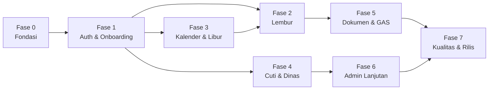

# Pemecahan Tugas (Task Breakdown) — LaporanTAD

Dokumen terkait: [BRD.md](BRD.md) · [PRD.md](PRD.md) · [ARSITEKTUR.md](ARSITEKTUR.md)

**Cara memakai dokumen ini**

- Tugas dipecah kecil (½–1 hari kerja) dan **berurutan berdasarkan dependensi** — kerjakan per fase, setiap tugas selesai dalam satu commit/PR sendiri agar mudah di-debug dan di-rollback.
- Setiap tugas punya **DoD (Definition of Done)** — kriteria "selesai" yang bisa diverifikasi.
- Estimasi: **S** ≤ 2 jam · **M** ≈ ½ hari · **L** ≈ 1 hari.
- ID tugas dirujuk sebagai dependensi (mis. T-203 butuh T-201).

## Peta Fase & Milestone

| Milestone | Tercapai setelah | Artinya |
|-----------|------------------|---------|
| **M0** | Fase 0 | Aplikasi kosong terdeploy, bisa baca-tulis Sheets & Drive |
| **M1** | Fase 1 | Login → registrasi → verifikasi admin → masuk beranda (end-to-end) |
| **M2 (MVP)** | Fase 2 + 3 | Lembur lengkap dipakai internal (termasuk 3 jenis lembur shift) |
| **M3** | Fase 4 | Cuti berkuota + dinas berjalan |
| **M4** | Fase 5 + 6 | Dokumen, ekspor rekap, master data lengkap |
| **M5 (Rilis)** | Fase 7 | Diuji, dipoles, siap dipakai seluruh pekerja |

---

## Fase 0 — Fondasi

| ID | Tugas | Dependensi | Est |
|----|-------|-----------|:---:|
| T-001 | **Buat Google Cloud Project**: aktifkan Sheets API, Drive API; konfigurasi OAuth consent screen (external) + credential OAuth (redirect Vercel & localhost) | — | M |
| T-002 | **Buat service account** + key JSON; catat email service account | T-001 | S |
| T-003 | **Buat spreadsheet database** dengan 15 tab & header sesuai [ARSITEKTUR.md](ARSITEKTUR.md) §6; bagikan ke service account (Editor); protect semua tab | T-002 | M |
| T-004 | **Buat struktur folder Drive** (§5) + bagikan ke service account; catat semua ID folder | T-002 | S |
| T-005 | **Init repo Next.js** (App Router, TS, Tailwind, shadcn/ui, ESLint, Prettier) + git init + push ke GitHub | — | M |
| T-006 | **Deploy pertama ke Vercel** + set semua environment variables (§11) | T-005, T-001 | S |
| T-007 | **Modul `lib/google/sheets.ts`**: klien Sheets generik (getRows, appendRow, updateRowById, deleteRowById) + `repositories/` kerangka + uji baca-tulis tab `settings` | T-003, T-006 | L |
| T-008 | **Init proyek GAS** (folder `gas/` + clasp): endpoint `doGet` ping ber-secret; simpan URL & secret di env | T-006 | M |
| T-009 | **Seed data awal**: perusahaan contoh, master opsi (3 lokasi, shift A–D, hubungan darurat, jenis cuti bawaan), settings default; skrip seed dapat diulang | T-007 | M |

**DoD Fase 0:** halaman `/health` di Vercel produksi menampilkan "Sheets OK · Drive OK · GAS OK".

## Fase 1 — Auth & Onboarding

| ID | Tugas | Dependensi | Est |
|----|-------|-----------|:---:|
| T-101 | **Integrasi Auth.js** Google provider; session JWT memuat email/nama/foto | T-006 | M |
| T-102 | **Repository `users`** + injeksi `role`/`status`/`user_id` ke session (cache 60 dtk) | T-007, T-101 | M |
| T-103 | **Middleware gerbang status**: routing pending/rejected/inactive/active/belum-terdaftar + halaman `menunggu`, `ditolak`, `nonaktif` | T-102 | M |
| T-104 | **Skema Zod registrasi** (semua field + normalisasi no. telp `62…`) — dipakai client & server | T-102 | S |
| T-105 | **Form registrasi 3 langkah** (mobile-first, draf lokal, validasi inline) + `POST /api/register` (cek nopek unik) | T-104 | L |
| T-106 | **Admin — antrean verifikasi**: daftar pending + detail + Setujui / Tolak (alasan wajib) + guard role admin (tanpa notifikasi email — hasil terlihat saat pendaftar login berikutnya) | T-103 | L |
| T-107 | **Modul `lib/audit.ts`** + catat semua aksi fase ini (registrasi, approve, reject) | T-007 | S |
| T-108 | **Kerangka layout**: bottom nav pekerja (5 item) + sidebar admin (drawer di ponsel) + halaman beranda pekerja sederhana (salam + menu) | T-103 | L |

**DoD Fase 1 (M1):** akun Google baru bisa registrasi → admin menyetujui dari desktop/ponsel → pada login berikutnya pekerja langsung masuk beranda (tanpa email). Akun ditolak melihat alasan.

## Fase 2 — Lembur (inti produk)

| ID | Tugas | Dependensi | Est |
|----|-------|-----------|:---:|
| T-201 | **Repository `overtime`** + skema Zod (semua jenis; aturan §5.3 PRD) | T-007 | M |
| T-202 | **Util hitung total jam** (lintas tengah malam, 2 desimal, **tanpa pembulatan**) + unit test kasus batas (22:00–06:00, 00:00–00:00) | — | S |
| T-203 | **Modul `lib/google/drive.ts` + `POST /api/upload`**: terima berkas, validasi tipe/ukuran, simpan ke folder evidence dengan nama terstandar | T-004, T-007 | M |
| T-204 | **Kompresi gambar client-side** (target ≤ 1,5 MB) + komponen unggah dengan pratinjau & progres | T-203 | M |
| T-205 | **Modul `lib/period-lock.ts`** + repository `period_locks`: fungsi `assertPeriodeTerbuka(tanggal)` dipakai semua mutasi | T-007 | S |
| T-206 | **Form catat lembur non-shift** (tanggal, keterangan, jam, evidence) + `POST /api/overtime` | T-201, T-202, T-204, T-205 | L |
| T-207 | **Form lembur shift**: field Jenis Lembur dinamis — Libur Nasional (dropdown dari `holidays`), KJK, Lembur Cuti (dropdown rekan shift aktif **satu lokasi & satu bagian** + peringatan lunak bila rekan tidak tercatat cuti) | T-206, T-303 | L |
| T-208 | **Daftar lembur**: grup Bulan → Tanggal, total jam per bulan, pull-to-refresh, empty state | T-206 | L |
| T-209 | **Detail + edit + hapus** catatan sendiri (blokir bila periode terkunci; audit log) | T-208 | M |
| T-210 | **Stream evidence** `GET /api/files/{id}` dengan cek akses (pemilik/admin) | T-203 | M |
| T-211 | **Admin — daftar lembur semua pekerja** + filter bulan/perusahaan/lokasi/jenis | T-208 | M |
| T-212 | **Validasi batas jam lembur** (`lib/overtime-rules.ts`): hari kerja maks 4 jam (kecuali KJK), akhir pekan/libur maks 12 jam, akumulasi mingguan maks 18 jam; nilai batas dibaca dari `settings`; pesan penolakan jelas + unit test | T-206, T-303 | M |

**DoD Fase 2:** pekerja shift & non-shift mencatat lembur lengkap dari ponsel; ketiga jenis shift berfungsi; evidence terbuka hanya oleh pemilik/admin; total jam benar (termasuk lintas hari, tanpa pembulatan); batas 4/12/18 jam ditegakkan (KJK dikecualikan pada hari kerja); bulan terkunci menolak mutasi.

## Fase 3 — Kalender & Libur Nasional

| ID | Tugas | Dependensi | Est |
|----|-------|-----------|:---:|
| T-301 | **Repository `holidays`** + CRUD admin (tambah/koreksi manual) | T-007 | M |
| T-302 | **GAS cron sync libur nasional** dari sumber publik (mis. API dayoff / Google Calendar "Hari Libur Indonesia") → tulis ke tab `holidays`; trigger tahunan + tombol sync manual admin | T-008, T-301 | M |
| T-303 | **`GET /api/holidays?year=`** + cache | T-301 | S |
| T-304 | **Halaman kalender bulanan**: penanda libur/cuti/dinas/lembur, ketuk tanggal → daftar kejadian, navigasi bulan; kejadian rekan difilter **satu lokasi & satu bagian** (admin melihat semua) | T-303, T-208 | L |

**DoD Fase 3:** kalender menampilkan libur nasional 2026 + kejadian; dropdown Libur Nasional di form lembur terisi dari data ini.

## Fase 4 — Cuti (berkuota) & Dinas

| ID | Tugas | Dependensi | Est |
|----|-------|-----------|:---:|
| T-401 | **Repository `leaves` + `leave_types` + `leave_balances`**; fungsi `hitungSisaSaldo(user, tahun)` (kuota + penyesuaian − terpakai) + unit test | T-007 | M |
| T-402 | **Util hitung jumlah hari cuti**: non-shift = eksklusif akhir pekan & libur; shift = hari kalender; dapat dikoreksi turun + unit test | T-303 | M |
| T-403 | **Form catat cuti** + validasi saldo (tolak bila kurang) + lampiran opsional/wajib sesuai jenis + kartu saldo (kuota/terpakai/sisa) | T-401, T-402, T-204, T-205 | L |
| T-404 | **Daftar cuti** (grup tahun → bulan) + edit/hapus dengan koreksi saldo otomatis | T-403 | M |
| T-405 | **Form + daftar dinas** (tujuan, tanggal, keperluan, transportasi, lampiran) | T-201-pola, T-205 | L |
| T-406 | **Admin — kelola kuota**: ubah kuota default (settings) & penyesuaian per pekerja; rekap saldo semua pekerja | T-401 | M |
| T-407 | **Admin — daftar cuti & dinas semua pekerja** + filter | T-404, T-405 | M |
| T-408 | **Integrasi kalender**: cuti & dinas tampil sebagai penanda | T-304, T-404, T-405 | S |

**DoD Fase 4:** saldo cuti akurat pada semua skenario catat/ubah/hapus lintas jenis; dinas tercatat; kalender menampilkan semuanya.

## Fase 5 — Dokumen & Template (GAS)

| ID | Tugas | Dependensi | Est |
|----|-------|-----------|:---:|
| T-501 | **Repository `documents`** + halaman Dokumen pekerja (kategori, cari, unduh via stream) | T-210 | M |
| T-502 | **Admin — unggah/hapus dokumen umum** ke `dokumen/umum/` | T-501 | M |
| T-503 | **Admin — CRUD template dokumen** (`doc_templates`, tautan Google Docs, daftar placeholder termasuk `{{ttd}}`) | T-007 | M |
| T-504 | **Komponen TTD**: unggah gambar / gambar di canvas + simpan TTD tersimpan (`users.ttd_file_id`, `PUT`/`DELETE /api/me/ttd`, folder `dokumen/ttd/`); gate "wajib TTD" dipakai semua alur generate | T-203 | M |
| T-505 | **GAS docgen**: endpoint copy template → replace `{{placeholder}}` → **sisip gambar TTD** → PDF (tanpa enkripsi) → simpan `generated/` → balas file_id; + `POST /api/generate` (pemilik/admin, cek kepemilikan + wajib TTD) | T-008, T-503, T-504 | L |
| T-506 | **Generate SPKL** per catatan lembur → PDF bertanda tangan | T-505, T-211 | M |
| T-507 | **Generate SPD & Deklarasi Dinas** per catatan dinas → PDF bertanda tangan | T-505, T-405 | M |
| T-508 | **Generate Surat Cuti** per catatan cuti → PDF bertanda tangan | T-505, T-404 | M |

**DoD Fase 5:** admin mengunggah SOP yang bisa diunduh pekerja; keempat dokumen (SPKL, SPD, Deklarasi Dinas, Surat Cuti) tergenerate dari template dengan data benar + gambar TTD tersisip; generate ditolak bila TTD belum disediakan.

## Fase 6 — Admin Panel Lanjutan

| ID | Tugas | Dependensi | Est |
|----|-------|-----------|:---:|
| T-601 | **CRUD Perusahaan** (halaman master) | T-108 | M |
| T-602 | **Master Data Pekerja**: tabel semua pekerja (cari/filter/sort), edit, set role, aktif/nonaktif | T-106 | L |
| T-603 | **CRUD Master Opsi** (lokasi, divisi, bagian, shift, jenis cuti) | T-108 | M |
| T-604 | **Halaman Kunci Periode**: kunci/buka per bulan + indikator bulan terkunci di seluruh form | T-205 | M |
| T-605 | **Ekspor XLSX/CSV**: lembur/cuti/dinas per bulan (filter perusahaan/lokasi) — kolom sesuai FR-ADM-07 | T-211, T-407 | L |
| T-606 | **Halaman Log Audit** (filter aktor/entitas/rentang tanggal) + **Dashboard admin** (FR-ADM-01) | T-107 | M |
| T-607 | **Direktori Data Pekerja** (sisi pekerja): kartu + cari/filter + tombol WA; tanpa kontak darurat | T-102 | M |

**DoD Fase 6:** admin mengelola seluruh master tanpa menyentuh spreadsheet; ekspor XLSX dibuka rapi di Excel; direktori tampil di ponsel.

## Fase 7 — Kualitas & Rilis

| ID | Tugas | Dependensi | Est |
|----|-------|-----------|:---:|
| T-701 | **GAS backup mingguan**: salin spreadsheet ke `arsip-backup/` (simpan 8 terakhir) | T-008 | S |
| T-702 | **Audit error handling**: semua kegagalan (Sheets down, upload gagal, sesi kadaluarsa) memberi pesan Indonesia yang jelas + data form tidak hilang | Fase 2–6 | L |
| T-703 | **Audit responsif & polish UI**: seluruh halaman (pekerja & admin) diuji di 360–430 px dan ≥ 1280 px; skeleton, toast, konfirmasi hapus, animasi halus | Fase 2–6 | L |
| T-704 | **Uji end-to-end happy path** (Playwright): onboarding → lembur shift 3 jenis → cuti potong saldo → generate Surat Cuti bertanda tangan → kunci periode → ekspor | Fase 2–6 | L |
| T-705 | **Pengujian kasus batas manual** (checklist): lembur lintas hari, saldo pas-pasan, periode terkunci, akun rejected re-apply, dua tab bersamaan | T-704 | M |
| T-706 | **Runbook operasional** (`docs/RUNBOOK.md`): cara menambah admin, buka kunci periode, restore backup, rotasi secret, sync libur manual | Semua | M |
| T-707 | **UAT bersama admin & 3–5 pekerja pilot** → perbaikan → go-live | T-705 | L |

**DoD Fase 7 (M5):** checklist Kriteria Penerimaan Rilis ([PRD.md](PRD.md) §11) hijau semua; runbook tersedia; pilot berhasil mencatat data nyata.

---

## Ringkasan

- **Total:** 48 tugas · 7 fase · 6 milestone.
- **Jalur kritis:** T-001 → T-007 → T-102 → T-103 → T-206 → T-207 (lembur shift = fitur paling khas produk ini).
- **Prinsip pengerjaan:** satu tugas = satu commit/PR = satu hal yang bisa diuji; jangan mulai fase baru bila DoD fase sebelumnya belum hijau; bila menemukan kebutuhan baru, tambahkan sebagai tugas baru di sini — jangan memperbesar tugas yang sedang berjalan.
